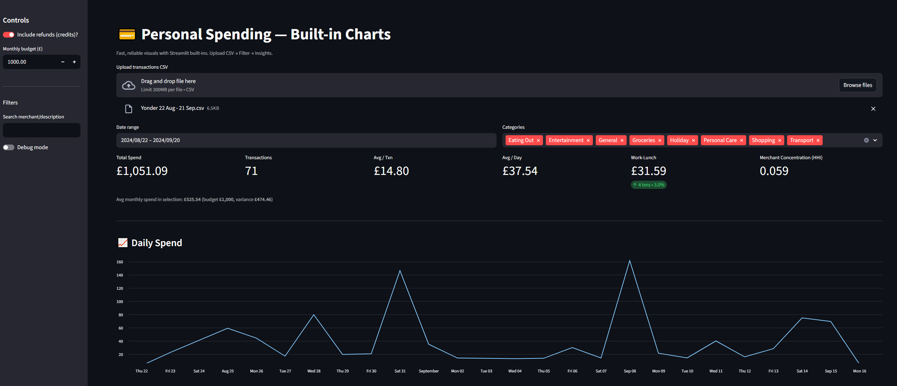

# 💳 Personal Spending Dashboard

A simple but powerful [Streamlit](https://streamlit.io/) app to analyze
your credit card transactions.\
This version uses **Streamlit built-in charts** only (no Altair), making
it robust and easy to run anywhere.

------------------------------------------------------------------------

## ✨ Features

-   **Upload CSV** (expected format similar to bank/credit card exports)
-   **KPIs**:
    -   Total spend
    -   Number of transactions
    -   Average per transaction
    -   Average daily & monthly spend
    -   Budget variance
    -   Work-lunch spend & share (weekdays 11:30--14:00, Eating Out)
    -   Merchant concentration (HHI index)
-   **Charts (built-in)**:
    -   Daily spend (line chart)
    -   Monthly spend (bar chart)
    -   Spend by category (bar chart)
    -   Hour-of-day pattern (line chart)
    -   Weekday pattern (bar chart)
-   **Work-lunch analysis** by month
-   **Top merchants** and **largest transactions**
-   **Anomaly detection** (robust MAD rule per category)
-   **Download filtered data** and aggregates (CSV)
-   Debug mode toggle for quick inspection

------------------------------------------------------------------------

## 📂 Project Structure

    personal-spending-dashboard/
    │── app.py               # Streamlit app
    │── utils.py             # Data preprocessing functions
    │── requirements.txt     # Dependencies
    │── README.md            # Project overview
    │── data/                # (Optional) place sample CSV here

------------------------------------------------------------------------

## ⚙️ Installation

Clone this repo and install dependencies:

``` bash
git clone https://github.com/<your-username>/yonder_spending_analysis.git
cd yonder_spending_analysis
pip install -r requirements.txt
```

------------------------------------------------------------------------

## ▶️ Run the App

Start Streamlit:

``` bash
python -m streamlit run app.py
```

Your browser will open at <http://localhost:8501>.

------------------------------------------------------------------------

## 📊 Example Dashboard

Here’s a sample screenshot of the dashboard:



------------------------------------------------------------------------

## 📝 Data Requirements

Your CSV should contain at least these columns (case-sensitive, as per
sample):

-   `Date/Time of transaction`
-   `Description`
-   `Amount (GBP)`
-   `Amount (in Charged Currency)`
-   `Currency`
-   `Category`
-   `Debit or Credit`
-   `Country`

See the provided `utils.py` for preprocessing logic.

------------------------------------------------------------------------

## 🚀 Roadmap / Ideas

-   Add budgeting goals and alerts
-   Export summary reports (PDF/Excel)
-   Add optional Altair charts for interactivity
-   Support more bank CSV formats

